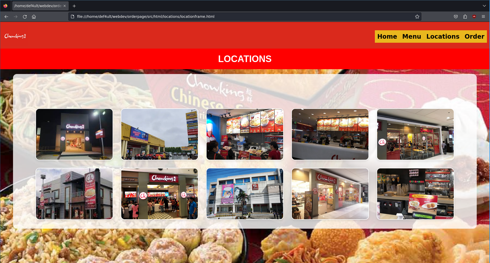

# Final Project in Web System and Technologies 1
(Second Semester of Academic Year 2023-2024)

## Submitted to
Mr. Raven Dave R. Gallardo

## Submitted by
- Casama Michael
- Datan Carl
- Dayson Ronnell
- Dela Serna

### Why did you choose that product or services to advertise?
All of us known Chowking and our group decided that it will be our reference for our final project since it’s quite simple and easy to replicate.

### How web page/s created will help the product or services?
It enhances customer engagement by providing detailed information online ordering and interactive features.

### Explain the parts of your web page/s
First of all, we have the home page where the content includes the Location, Menu, and Order Page. The Location includes all the available Chowking Branch in Naic Cavite. Next is our Menu that includes different foods and each have four varieties. Last but not the least is our Order Page where you can buy as many foods as you like and the total sum will display on the right side.

### Home Page

### Location Page

### Menu Page

### Order Page

> “Carl appoints all the group members their own parts for the final project”
> 
> “Home Page coded by Ronnell”
> 
> “Location coded by Michael”
> 
> “Menu coded by Vincent”
> 
> “Order Page coded by Carl”
> 
